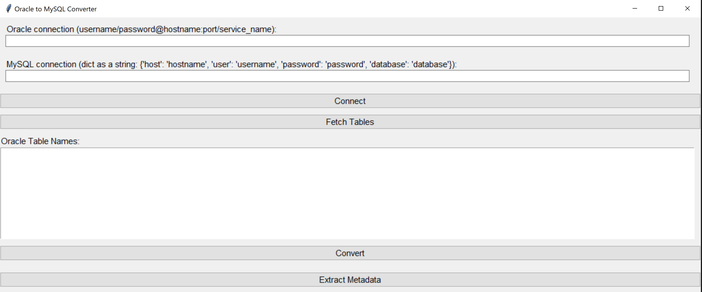

# CONVERT ORACLE TO MYSQL

Hello this script is done with the purpose of converting Oracle Database to MySQL Database, moving columns, indexes, constraints and triggers.  

## Steps

1. Install Microsoft Visual C++ 14.0 or greater -- https://visualstudio.microsoft.com/visual-cpp-build-tools/
2. Install Python 3.11 -- https://www.python.org/
3. Install Oracle Instant Client -- https://www.oracle.com/database/technologies/instant-client.html (Version 21_10)
4. Extract and Copy instantclient_21_10 on the folder where you will have the script.
5. Install the following list of libreries on python 
    1. pip install tkinter
    2. pip install cx_Oracle
    3. pip install mysql.connector
    4. pip install PyInstaller

## Image

